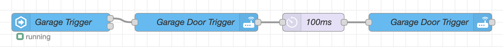

# ESPHome Based Garage Monitor

## Introduction
I built this circuit board to monitor my garage as well as control the garage door opener. This board is capable of reading door state through a switch, controlling the door, and using a BME680 to measure, temperature, humidity, volatile organic compounds (combustible gasses), and carbon dioxide.

## Hardware
Custom PCB created in Eagle CAD. I had these run at [seeedstudio-fusion](https://www.seeedstudio.com/fusion_pcb.html). The boards have been tested and are currently functioning in my garage.

## Interfacing with the garage door opener
There are inputs and outputs to read and control up to two doors. The ```DoorX-In``` are a simple digital read. I use magnetic reed switches that are normally open for this. They can be had cheaply as many alarm system used the for door and window sensors like [this](https://www.amazon.com/VictorsHome-Magnetic-Surface-Adhesive-Security/dp/B094XJ7K8K).

To controll the door simply run a 2 conductor wire from the ```DoorX`` screw terminals to the same terminals that the wall switch mounted inside the garage is connected to.

## Home Assistant Configuration
ESPHome needs to be installed and functioning:
1) Click on ```+ NEW DEVICE```
1) Click ```Continue```
2) Give it a name, I chose ```garage-monitor```
3) Select ```Pick specific board``` and ```Wemos D1 and Wemos D1 mini```
4) Select ```Skip```
5) Find the device and click ```EDIT```
6) Paste in the [yaml](ESPHome/garage-sensor.yaml) file and edit the proper wifi setting.
  


## Automations
I use NodeRed to automate many aspects of my smart home. Here are a couple related to my garage to get you going.
- Notify via pushover if the garage door is open for 15 minutes [json](NodeRed%20Flows/notify-door-open.json) 
- Quick reset the output on the "button push" (There is probably a better way to do this but I found this to be effective) [json](NodeRed%20Flows/quick-trigger.json) 

## To Do...
There's two WS2812b on the board that I haven't found a use for yet, they could be used for a number of things though. examples:
- Countdown timer until autmoated shut of garage door
- Gauge estimates like [this](images/lovelace_gauge_segments.png) for Temp, VOC, Humidity, CO2.
- etc